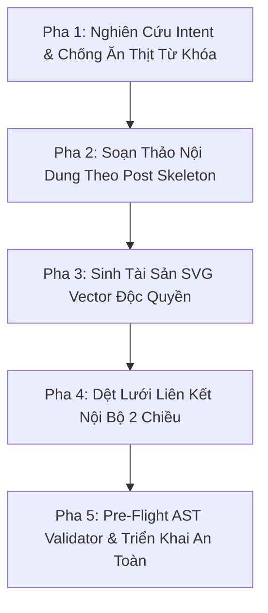

# 📝 Quy Trình Xuất Bản Blog AIzalo Đồng Bộ (aizalo.com Blog Pipeline)

Quy trình này chuẩn hóa 100% các bước sản xuất, tối ưu hóa SEO/GEO, tạo tài sản đồ họa vector, liên kết nội bộ và triển khai bài viết trên `https://aizalo.com/blog/` theo đúng các quy chuẩn bất biến của **AGENTS.md** và **website/AGENTS.md**.

> [!TIP]
> **Khuyến nghị chất lượng SEO & An toàn Portal:** Kỹ năng này vận hành theo nguyên tắc **One-Way Door Deployment Guardrail**. Agent tự động hóa toàn bộ quá trình biên tập, sinh ảnh, dệt link và build kiểm tra cục bộ; nhưng **BẮT BUỘC phải dừng lại xin xác nhận của người dùng** trước khi chạy lệnh phát hành Production lên Cloudflare Pages.

---

## 🛠️ Quy Trình 5 Pha Điều Phối (Execution Workflow)



---

### Pha 1: Pre-flight Research & DataForSEO Intent Validation

Trước khi viết bài, Agent **BẮT BUỘC** gọi MCP Tool `dataforseo` để lấy dữ liệu thực nghiệm thị trường Việt Nam (`location_code: 2704`, `language_code: "vi"`):

1. **Bước 1.1: Truy vấn Khối lượng tìm kiếm & Ý định người dùng (Volume & Search Intent):**
   - Gọi tool `call_mcp_tool` (`ServerName: "dataforseo"`, `ToolName: "api_request"`) với endpoint `/v3/keywords_data/google_ads/search_volume/live`:
     ```json
     [
       {
         "location_code": 2704,
         "language_code": "vi",
         "keywords": ["<từ-khóa-1>", "<từ-khóa-2>", "<từ-khóa-3>"]
       }
     ]
     ```
   - Trích xuất: `search_volume`, `competition`, `cpc` và tỷ lệ `intent` (ưu tiên bài viết có **Transactional > 50%** để dẫn phễu tải Zalo-Flow).

2. **Bước 1.2: Phân tích Lỗ hổng Đối thủ SERP Top 10 (Competitor Gap Analysis):**
   - Gọi endpoint `/v3/serp/google/organic/live/advanced` cho từ khóa chính số 1:
     ```json
     [
       {
         "location_code": 2704,
         "language_code": "vi",
         "keyword": "<từ-khóa-chính-nhất>"
       }
     ]
     ```
   - Đọc 10 kết quả đầu tiên để xác định: *Đối thủ đang hướng dẫn cái gì? Họ có điểm yếu nào khiến người đọc thất vọng?* (Ví dụ: báo lớn hướng dẫn tính năng Nhắc hẹn Zalo không tự gửi tin, hoặc ép mua Zalo OA doanh nghiệp đắt đỏ). 
   - Biến lỗ hổng đó thành **đòn đánh chiến lược** cho bài viết aizalo.com.

3. **Bước 1.3: Khóa chống tự ăn thịt từ khóa (Keyword Cannibalization Guard):**
   - Quét qua danh sách các bài viết hiện có trong `website/src/blog/`:
     - `cach-gui-tin-nhan-tu-dong-tren-zalo-khong-bi-khoa.html` (Đã chiếm giữ: `tin nhắn tự động zalo`, `anti-ban`).
     - `huong-dan-cach-tao-chatbot-zalo-ca-nhan.html` (Đã chiếm giữ: `tạo chatbot zalo cá nhân`, `bot zalo`).
     - `tich-hop-ai-gemini-deepseek-vao-zalo-ca-nhan.html` (Đã chiếm giữ: `tích hợp ai vào zalo`, `gemini`, `deepseek`).
     - `zalo-crm-la-gi-giai-phap-quan-ly-tin-nhan-cskh.html` (Đã chiếm giữ: `zalo crm`, `quản lý tin nhắn cskh`).
     - `cach-hen-gio-gui-tin-nhan-zalo-ca-nhan-tu-dong.html` (Đã chiếm giữ: `hẹn giờ gửi tin nhắn zalo`).
   - **Quy tắc bất biến:** TUYỆT ĐỐI KHÔNG đưa từ khóa cốt lõi của bài cũ vào Title, H1 hoặc H2 của bài viết mới. Bài mới phải khu trú 100% vào từ khóa ngách độc lập.

---

### Pha 2: Soạn Thảo Nội Dung (Inverted Pyramid Hybrid Formula)

Đọc file khung xương mẫu tại: [`.agents/skills/aizalo-blog/references/post-skeleton.html`](file:///d:/A-Du-An/Zalo-Flow/.agents/skills/aizalo-blog/references/post-skeleton.html)

#### Cấu Trúc Kim Tự Tháp Ngược Bắt Buộc:
1. **0–5 giây đầu tiên (Thỏa mãn Intent tức thì):**
   - Thẻ `<title>`: Kiểm soát nghiêm ngặt trong khoảng **50–70 ký tự** (bao gồm hậu tố `— AIzalo.com`) chống bị Google cắt ngắn.
   - Thẻ `H1`: Chứa từ khóa chính số 1.
   - Thẻ `` Hero Banner: Đặt ngay dưới H1.
   - **GEO Direct Answer Box (`.geo-answer-box`):** Đoạn định nghĩa chuẩn xác từ **40–60 từ** đặt trong `<p class="geo-answer-text">` để cướp trích dẫn Google AI Overview và Perplexity.
   - **Key Takeaways Box (`.geo-tldr-box`):** 4 gạch đầu dòng then chốt cho người đọc vội.
2. **Thân bài (Storytelling Khoa AI + Hướng dẫn kỹ thuật):**
   - **Dopamine Cliffhanger Hook:** Mở đầu bằng một tình huống thực tế "báo động đỏ" khiến người đọc tò mò.
   - **Oxytocin Empathy:** Khắc họa sự đồng cảm sâu sắc với nỗi đau bất lực của người dùng khi app Zalo thiếu tính năng.
   - **Hardcoded Semantic Headings:** Mọi thẻ `<h2>`, `<h3>` phải có sẵn thuộc tính `id="tieu-de-khong-dau"` tĩnh trong HTML.
   - **Endorphin Humor & Turning Point:** Tháo nút thắt bất ngờ bằng tính năng độc quyền của Zalo-Flow (ví dụ Auto-Pause, tự nén ảnh HD...).
   - **Table Responsive Wrapper:** Mọi bảng so sánh BẮT BUỘC bọc trong `<div class="geo-table-wrapper">`.
3. **Cuối bài (FAQ, CTA & Khối Bài Viết Liên Quan Semantic Isolation):**
   - **FAQ Section:** Tối thiểu 3–4 câu hỏi trả lời chi tiết bằng `<details class="geo-faq-item">` tương ứng với Schema JSON-LD.
   - **CTA Box:** BẮT BUỘC dùng `<div class="cta-box"><div class="cta-title">...</div>...</div>`. **TUYỆT ĐỐI KHÔNG dùng thẻ `<h2>` hoặc `<h3>` trong CTA Box** để không làm ô nhiễm bộ sinh mục lục tự động `blog-toc.js`.
   - **Khối Bài Viết Liên Quan (`.related-posts-section`):** Đặt bên ngoài thẻ `</article>` (ngay sau `.article-layout` và trước `<footer>`), hiển thị Grid 3 bài viết ngữ cảnh liên quan nhất với tiêu đề `<h2 class="related-title" id="bai-viet-lien-quan">` để giảm Bounce Rate và tăng sức mạnh SEO internal links.
   - **Script Tương Tác UX:** BẮT BUỘC nhúng `<script src="/blog-toc.js"></script>` ở chân trang để kích hoạt Mục lục tự động và Nút Scroll-to-Top kèm Circular Reading Progress Ring.

---

### Pha 3: Sinh Bộ Tài Sản SVG Vector Độc Quyền

Đọc quy chuẩn thiết kế tại: [`.agents/skills/aizalo-blog/references/svg-design-tokens.md`](file:///d:/A-Du-An/Zalo-Flow/.agents/skills/aizalo-blog/references/svg-design-tokens.md)

Agent tạo thư mục `website/src/assets/blog/<slug>/` và sinh tối thiểu 3 file SVG vector:
1. `anh-bia-<slug>.svg`: Kích thước `viewBox="0 0 1200 630"`, chứa badge chủ đề, tiêu đề chính 44px và mockup Zalo-Flow.
2. `so-sanh-...svg`: Kích thước `viewBox="0 0 1000 480"`, infographic chia 3 cột so sánh.
3. `giao-dien-...svg`: Kích thước `viewBox="0 0 1000 500"`, mockup giao diện cửa sổ Zalo-Flow desktop màu Dark/Cyan.
*Yêu cầu kỹ thuật:* File SVG vector nhẹ < 5KB, không dùng ảnh raster ngoài, hiển thị sắc nét trên màn hình Retina/4K.

---

### Pha 4: Dệt Lưới Liên Kết Nội Bộ 2 Chiều (2-Way Link Mesh)

Để triệt tiêu hoàn toàn rủi ro **Orphan Page** và bơm PageRank:
1. **Outbound Links (Bài mới trỏ đi):**
   - Trỏ về Trang chủ `https://aizalo.com/` (tải app Zalo-Flow).
   - Trỏ sang ít nhất 2 bài blog cũ cùng chủ đề kèm Anchor Text giàu ngữ cảnh.
   - Trỏ tới tài liệu kỹ thuật `guide.md`.
2. **Inbound Links (Bài cũ trỏ ngược vào bài mới):**
   - Agent **BẮT BUỘC mở ít nhất 2 bài viết cũ** trong `website/src/blog/` để chèn một khối Callout giới thiệu và dẫn link tới bài viết mới.
   - **Cập nhật Content Freshness:** Sửa trường `"dateModified": "YYYY-MM-DD"` trong Schema JSON-LD của các bài cũ thành ngày hiện tại.

---

### Pha 5: Ma Trận Đồng Bộ 6 Điểm Chạm, AST Validator & Deploy Guardrail

Đọc bảng kiểm tra tại: [`.agents/skills/aizalo-blog/references/sync-checklist.md`](file:///d:/A-Du-An/Zalo-Flow/.agents/skills/aizalo-blog/references/sync-checklist.md)

#### 1. Rà soát Ma trận 6 điểm chạm:
- [ ] 1. Thêm card bài viết mới lên đầu trang `website/src/blog/index.html`.
- [ ] 2. Chèn Inbound Link và cập nhật `dateModified` trong các bài blog cũ.
- [ ] 3. Cập nhật `website/src/sitemap.xml` (thêm URL mới, cập nhật `<lastmod>` của `/` và `/blog/`).
- [ ] 4. Cập nhật `website/src/guide.md` và `website/src/wiki.md` (Conditional AI Knowledge Ops):
       * **NẾU bài viết về TÍNH NĂNG MỚI Zalo-Flow (Feature/How-to):** BẮT BUỘC cập nhật: (1) Thêm tóm tắt tính năng ở Mục 2; (2) Thêm câu hỏi FAQ kèm Deep-Link bài blog ở Mục 3; (3) Thêm mẫu đối thoại Few-Shot ở Mục 4.
       * **NẾU bài viết về MẸO KINH DOANH / CASE STUDY MỞ RỘNG (General SEO Tips):** BỎ QUA `guide.md` & `wiki.md` để chống phình to bộ não Bot AI (Prompt Bloat Guardrail < 250 dòng).
- [ ] 5. Cập nhật `website/src/llms.txt` và `website/src/llms-full.txt`.
- [ ] 6. Đồng bộ thư mục `website/dist/`.

#### 2. Chạy Pre-Flight AST, Schema Validator & Unified Audit 2-Pass:
Chạy lệnh kiểm tra cú pháp nhanh và đo kiểm toàn diện 4 trụ cột (On-page SEO, Technical, GEO, Agent Readiness Level 5):
```powershell
node -e "
const fs = require('fs');
const html = fs.readFileSync('website/src/blog/<slug>.html', 'utf8');
if (html.includes('<h2') && !html.match(/<h2 id=\"[a-z0-9-]+\"/)) throw new Error('Missing static id in H2');
const jsonMatch = html.match(/<script type=\"application\/ld\+json\">([\s\S]*?)<\/script>/);
if (jsonMatch) JSON.parse(jsonMatch[1]);
console.log('✅ AST & Schema Validation Passed!');
"

# Đo kiểm toàn diện 2-Pass đảm bảo đạt 100/100 tuyệt đối
node scripts/audit-aizalo.mjs
```

#### 3. Biên dịch Tĩnh Cục Bộ (Local Build):
```powershell
powershell website/build.ps1
```

#### 4. Khóa An Toàn Phát Hành (One-Way Door Deployment Guardrail):
> [!CAUTION]
> **Dừng lại xin phê duyệt:** Tuyệt đối KHÔNG tự ý chạy lệnh `npx wrangler pages deploy`. 
> Agent phải dừng lại, báo cáo kết quả audit 100/100 và build thành công cho người dùng kèm danh sách tệp đã thay đổi. Chỉ khi người dùng nhắn xác nhận ("OK deploy" hoặc "Đồng ý phát hành"), Agent mới thực thi:
> ```powershell
> npx wrangler pages deploy website/dist --project-name aizalo-portal
> ```
