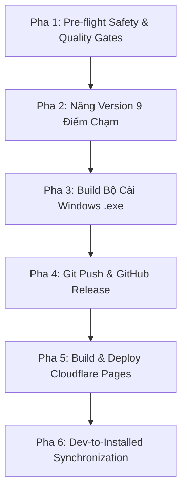

# 🚀 Quy Trình Phát Hành Phiên Bản Zalo-Flow Đồng Bộ (Zalo-Flow Release Pipeline)

Quy trình này tự động hóa và chuẩn hóa 100% việc phát hành phiên bản mới của Zalo-Flow theo đúng quy chuẩn bất biến của **AGENTS.md Trụ Cột VI, Điều 2**.

> [!IMPORTANT]
> **Quy Chuẩn Đồng Bộ Bất Biến (Desktop Binary & Portal Website Release Synchronization Invariant):**
> Tuyệt đối không để xảy ra tình trạng mã nguồn Git hoặc GitHub Releases đã nâng phiên bản mà website `https://aizalo.com/` hoặc README vẫn hiển thị phiên bản và nút tải cũ. Người dùng cuối truy cập website tải về là nhận ngay 100% bản mới nhất.

---

## 🛠️ Quy Trình 6 Pha Thực Thi (Execution Workflow)



---

### Pha 1: Pre-flight Safety & Quality Gates (Bắt buộc kiểm tra)

Trước khi tiến hành bất kỳ thao tác đóng gói nào, Agent **BẮT BUỘC** thực hiện các bước kiểm tra an toàn:
1. **Kiểm tra rò rỉ Secrets (.env Check):**
   - Kiểm tra file `.gitignore` chứa `.env*` và `installer/output/`.
   - Chạy `git status` đảm bảo không có file chứa credentials bị stage.
2. **Kiểm tra cú pháp JavaScript:**
   - Chạy `node --check public/app.js`
   - Chạy `node --check src/index.js`
   - Chạy `node --check src/adapters/ai-agent.js`
   - Chạy `node --check src/zalo-client.js`
   - Chạy `node --check src/utils/local-store.js`
3. **Chạy toàn bộ Test Suites:**
   - Chạy `npm test` và bảo đảm **100% test cases pass**.
   - Kiểm tra bộ nhớ RAM của tiến trình trong test đạt chuẩn `< 100MB`.

---

### Pha 2: Nâng Version Đồng Bộ 9 Điểm Chạm

Khi phát hành phiên bản mới `vX.X.X` (ví dụ `1.0.7`), Agent cập nhật đồng bộ các file sau:

1. **`package.json`**: Cập nhật `"version": "X.X.X"`.
2. **`installer/setup.iss`**: Cập nhật `#define MyAppVersion "X.X.X"`.
3. **`README.md`**:
   - Cập nhật số lượng test trên badge (ví dụ: `40/40 Passing`).
   - Cập nhật nút tải: `ZaloFlow-Setup-vX.X.X.exe`.
   - Bổ sung mục tóm tắt tính năng mới của `vX.X.X`.
4. **`README.en.md`**:
   - Cập nhật tương tự bản tiếng Việt (download button, badges, what's new).
5. **`website/src/index.html`**:
   - Cập nhật số version hiển thị và link tải file `ZaloFlow-Setup-vX.X.X.exe`.
6. **`website/src/llms.txt`**:
   - Cập nhật phiên bản mới nhất cho AI Crawlers.
7. **`website/src/llms-full.txt`**:
   - Cập nhật tài liệu toàn văn cho AI search engines.
8. **`website/src/guide.md` & `website/src/wiki.md` (AI Knowledge Ops):**
   - Cập nhật phiên bản & link tải file cài đặt mới nhất `ZaloFlow-Setup-vX.X.X.exe`.
   - Bổ sung hướng dẫn các tính năng mới vào mục `📚 2. Kho Tri Thức Sản Phẩm (Memory)`.
   - Bổ sung các câu hỏi thường gặp mới vào mục `❓ 3. Bách Khoa Hỏi Đáp (Q&A FAQ)`.
   - Giúp người dùng khi bấm **🔄 Cập Nhật URL** trên Zalo-Flow là Bot AI được nạp ngay tri thức mới nhất về bản phát hành.
9. **`CHANGELOG.md`** *(nếu có)*:
   - Thêm mốc lịch sử phiên bản `[X.X.X] - YYYY-MM-DD`.

---

### Pha 3: Biên Dịch Bộ Cài Đặt Windows Native (.exe)

1. Chạy script đóng gói Inno Setup 6:
   ```powershell
   powershell -ExecutionPolicy Bypass -File installer/build-local.ps1
   ```
2. Kiểm tra tệp xuất ra tại `installer/output/ZaloFlow-Setup-vX.X.X.exe`:
   - Xác nhận file tồn tại.
   - Dung lượng an toàn phải nằm trong khoảng **20MB - 30MB**.

---

### Pha 4: Git Push & Tạo GitHub Release

1. **Commit & Push Git:**
   - Thêm các file thay đổi vào Git:
     ```powershell
     git add package.json installer/setup.iss README.md README.en.md website/src/ src/ public/ test/
     git commit -m "chore(release): vX.X.X - <Tóm tắt điểm mới>"
     git push origin main
     ```
2. **Tạo GitHub Release qua GitHub CLI:**
   - Xuất bản release kèm file `.exe`:
     ```powershell
     gh release create vX.X.X installer/output/ZaloFlow-Setup-vX.X.X.exe --title "vX.X.X — <Tiêu đề phát hành>" --notes "<Nội dung tóm tắt tính năng mới>"
     ```

---

### Pha 5: Biên Dịch & Triển Khai Cổng Thông Tin aizalo.com

1. **Biên dịch Website Tĩnh:**
   ```powershell
   powershell -ExecutionPolicy Bypass -File website/build.ps1
   ```
   - Kiểm tra thư mục đầu ra `website/dist/`.
2. **Triển khai lên Cloudflare Pages:**
   ```powershell
   npx wrangler pages deploy website/dist --project-name aizalo-portal
   ```
   - Xác nhận URL triển khai trả về mã 200 OK.

---

### Pha 6: Đồng Bộ Mã Nguồn Dev Sang Ứng Dụng Desktop

Theo quy chuẩn AGENTS.md Trụ Cột VI, Điều 6:
```powershell
Copy-Item -Path "d:\A-Du-An\Zalo-Flow\src\*" -Destination "$env:LOCALAPPDATA\Programs\ZaloFlow\src" -Recurse -Force
Copy-Item -Path "d:\A-Du-An\Zalo-Flow\public\*" -Destination "$env:LOCALAPPDATA\Programs\ZaloFlow\public" -Recurse -Force
```

---

## 📋 Báo Cáo Kết Quả Sau Khi Release

Sau khi hoàn tất quy trình, Agent xuất báo cáo tóm tắt:
- **Phiên bản phát hành:** `vX.X.X`
- **Bộ cài đặt Windows:** `ZaloFlow-Setup-vX.X.X.exe` (Dung lượng, link tải GitHub Releases)
- **Cổng thông tin cộng đồng:** `https://aizalo.com/` (Đã deploy Cloudflare Pages)
- **Tình trạng kiểm thử:** 100% tests pass, 0 lỗi cú pháp.
