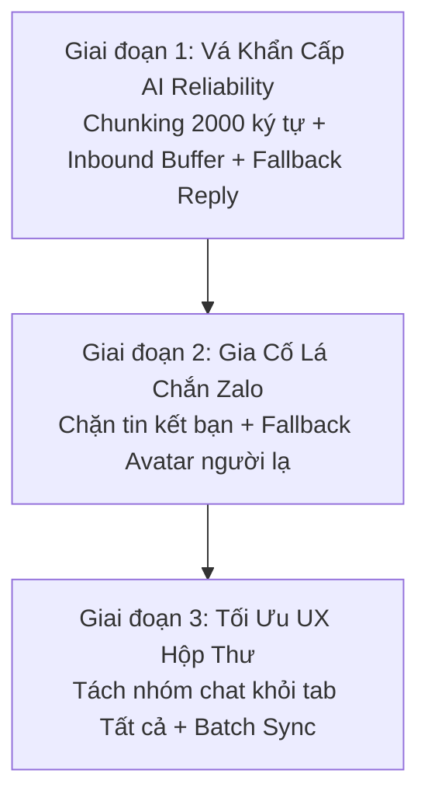

# 📋 ĐỀ XUẤT NÂNG CẤP HỆ THỐNG ZALO-FLOW (KẾ THỪA TỪ PLUGIN-ZALOFLOW 2.0)

> **Mục tiêu:** Kế thừa các giải pháp thực chiến đã được chứng minh và giải quyết triệt để tại dự án `Plugin-ZaloFlow` (bản 2.0 Microkernel) để nâng cấp độ tin cậy, an toàn và trải nghiệm người dùng cho `Zalo-Flow` (bản 1.0 Monolith).  
> **Ngày lập:** 04/10/2026  
> **Tác giả:** Trợ lý Kỹ thuật AI (Pair Programming)  

---

## 🏛️ 1. Bảng Ma Trận Đối Soát Kỹ Thuật

| Tính năng / Vấn đề kỹ thuật | Hiện trạng tại `Zalo-Flow` | Trạng thái sau nâng cấp (chuẩn Plugin-ZaloFlow 2.0) | Mức độ ưu tiên |
| :--- | :--- | :--- | :--- |
| **Tin nhắn AI $> 2.000$ ký tự** | ❌ Lỗi Zalo API `"Nội dung quá dài"`, Bot im lặng hoàn toàn | ✅ Tự động cắt đoạn thông minh `splitMessageForZalo`, gửi 2-3 phần tuần tự | 🔴 P0 - Critical |
| **Khách nhắn dồn dập lúc AI đang chạy** | ❌ Gọi 2 tiến trình LLM song song (Race Condition), gửi 2 tin chồng chéo | ✅ Khóa đơn nguyên + Hàng đợi đệm, tự động xả và gộp câu hỏi xử lý nối tiếp | 🔴 P0 - Critical |
| **Sự cố mạng / Timeout LLM** | ❌ Bị ngắt kết nối, Bot câm lặng bỏ rơi khách | ✅ Tự động gửi Graceful Fallback phản hồi lịch sự ngay cho khách | 🟡 P1 - High |
| **Thông báo kết bạn Zalo** | ❌ Bot tưởng tin nhắn thật, tự phát sinh câu chào AI kỳ quặc | ✅ Chặn 100% bằng Friend Event Regex Guard | 🟡 P1 - High |
| **Avatar khách lạ chưa kết bạn** | ❌ Mất avatar (hiện ảnh xám), tên hiển thị dạng UID thô | ✅ Fallback 3 tầng qua Profile URL & Full Avatar + Batch Sync | 🟢 P2 - Medium |
| **Tab "Tất cả" trong Inbox** | ❌ Bị lẫn lộn nhóm chat với khách hàng 1-1 | ✅ Lọc sạch nhóm khỏi "Tất cả", cô lập nhóm vào tab riêng "👥 Nhóm" | 🟢 P2 - Medium |

---

## 🔍 2. Chi Tiết Các Hạng Mục Nâng Cấp

---

### 🔴 Đề Xuất 1: Smart Message Chunking (Chống vỡ trần 2.000 ký tự Zalo)

#### 1. Hiện trạng & Rủi ro:
* **Vị trí code:** [`src/adapters/ai-agent.js`](file:///D:/A-Du-An/Zalo-Flow/src/adapters/ai-agent.js#L473) và [`src/zalo-client.js`](file:///D:/A-Du-An/Zalo-Flow/src/zalo-client.js#L842).
* **Rủi ro thực tế:** Khi khách hàng hỏi các câu hỏi cần tư vấn chi tiết (pháp luật, hướng dẫn cấu hình, bảng giá dài, chính sách bảo hành), câu trả lời AI sinh ra $> 2.000$ ký tự. Máy chủ Zalo từ chối với mã lỗi nguyên văn: `"Nội dung quá dài"`. Khối `catch` nuốt lỗi, khiến Bot hoàn toàn câm lặng với khách hàng.

#### 2. Giải pháp kỹ thuật:
* Bổ sung hàm tiện ích `splitMessageForZalo(text, maxChunkLen = 1750)`:
  * Ưu tiên ngắt theo đoạn văn (`\n\n`), ngắt dòng (`\n`), dấu chấm câu kết thúc ý (`. `), hoặc khoảng trắng.
  * Chia nhỏ thành các đoạn $\le 1.750$ ký tự, đánh số phần `(Phần X/Y)`.
  * Quote reply và attachments chỉ gắn vào phần đầu tiên. Các phần tiếp theo gửi text nối tiếp với giãn cách an toàn 1.2s.
* Trang bị cơ chế tự động chia nhỏ khẩn cấp trong khối `catch` của `zalo-client.js` khi nhận lỗi `"quá dài"`.

---

### 🔴 Đề Xuất 2: Concurrency Lock & Hàng Đợi Đệm (Per-Thread Inbound Queue)

#### 1. Hiện trạng & Rủi ro:
* **Vị trí code:** [`src/adapters/ai-agent.js`](file:///D:/A-Du-An/Zalo-Flow/src/adapters/ai-agent.js#L321-L380).
* **Rủi ro thực tế:** Thói quen của người dùng Zalo là gõ câu hỏi thành nhiều tin nhắn ngắn liên tiếp (ví dụ: Tin 1: *"Tư vấn giúp mình gói Pro"*, 5 giây sau gửi tiếp Tin 2: *"Có hỗ trợ xuất hóa đơn không"*).
* Hiện tại hệ thống chỉ có `debounceSeconds = 3` trước khi gọi LLM. Khi tiến trình LLM đang chạy (mất 10-25s), tin nhắn thứ hai đến sẽ kích hoạt một tiến trình `_processAutoReply` thứ hai **chạy song song**, gây lãng phí token x2 và Bot gửi 2 câu trả lời chồng chéo.

#### 2. Giải pháp kỹ thuật:
* Bổ sung cơ chế khóa đơn nguyên `activeProcessingThreads = new Set()` và hàng đợi đệm `threadInboundBuffers = new Map()`.
* Khi có tin nhắn mới đến trong lúc thread đang bận: Đưa tin nhắn vào hàng đợi đệm.
* Trong khối `finally`: Tự động xả đệm (Drain & Combine), gộp các tin nhắn bổ sung của khách lại và kích hoạt lượt trả lời tiếp theo. Đảm bảo **100% không bỏ sót bất kỳ tin nhắn nào**.

---

### 🟡 Đề Xuất 3: Graceful Fallback Reply khi AI Gặp Sự Cố Mạng / Timeout

#### 1. Hiện trạng & Rủi ro:
* **Vị trí code:** [`src/adapters/ai-agent.js`](file:///D:/A-Du-An/Zalo-Flow/src/adapters/ai-agent.js#L495-L498).
* **Rủi ro thực tế:** Khi router AI bị trễ mạng quốc tế hoặc gặp lỗi 500/502/Timeout, khối `catch` chỉ ghi log `logger.error` và kết thúc. Khách hàng ngồi chờ và nghĩ rằng Bot bị đơ hoặc bỏ rơi mình.

#### 2. Giải pháp kỹ thuật:
* Bổ sung tin nhắn cứu hộ tự động (chỉ áp dụng cho chat cá nhân 1-1, bỏ qua nhóm):
  > *"Dạ em đang kiểm tra lại thông tin nhưng đường truyền mạng AI tạm thời bị chậm một chút. Bạn đợi em trong giây lát hoặc nhắn lại giúp em nhé ạ!"*
* Khách hàng luôn nhận được phản hồi và có trải nghiệm chăm sóc chuyên nghiệp.

---

### 🟡 Đề Xuất 4: Friend & System Event Guard (Chống Tự Nhắn Tin Khi Vừa Kết Bạn)

#### 1. Hiện trạng & Rủi ro:
* **Vị trí code:** [`src/utils/message-parser.js`](file:///D:/A-Du-An/Zalo-Flow/src/utils/message-parser.js) và [`src/adapters/ai-agent.js`](file:///D:/A-Du-An/Zalo-Flow/src/adapters/ai-agent.js#L260).
* **Rủi ro thực tế:** `Zalo-Flow` hiện tại chưa có bộ lọc Regex nhận diện sự kiện kết bạn. Khi vừa đồng ý kết bạn, máy chủ Zalo tự gửi tin nhắn hệ thống: *"Bạn và Lê Hân đã trở thành bạn bè..."*. Bot AI coi đây là tin nhắn của khách và tự động trả lời một câu ngô nghê.

#### 2. Giải pháp kỹ thuật:
* Bổ sung Regex chặn cứng tại tầng Inbound:
  ```javascript
  const isSystemFriendEvent = /^(bạn vừa kết bạn với|bạn và .* đã trở thành bạn bè|các bạn đã trở thành bạn bè|đã chấp nhận yêu cầu kết bạn|hai bạn đã trở thành bạn bè|you are now connected with)/i.test(text);
  if (isSystemFriendEvent) return; // Bỏ qua 100%, không sinh câu trả lời
  ```

---

### 🟢 Đề Xuất 5: Multi-Fallback Avatar Resolution cho Người Lạ (Stranger Identity)

#### 1. Hiện trạng & Rủi ro:
* **Vị trí code:** [`src/zalo-client.js`](file:///D:/A-Du-An/Zalo-Flow/src/zalo-client.js).
* **Rủi ro thực tế:** Khi người lạ (chưa kết bạn) nhắn tin đến Zalo cá nhân, hàm `getUserInfo` của `zca-js` trả về dữ liệu rỗng. Khách hàng trên giao diện Web UI hiển thị avatar xám mặc định hoặc tên dạng số UID thô.

#### 2. Giải pháp kỹ thuật:
* Bổ sung chuỗi truy cứu danh tính dự phòng 3 tầng:
  1. Bóc tách key `${uid}_0` từ profile store.
  2. Fallback sang `api.getAvatarUrlProfile(uid)`.
  3. Fallback sang `api.getFullAvatar(uid)`.
* Tích hợp cơ chế quét bù avatar theo lô (`resolveBatchAvatars`) cho danh sách hội thoại đang thiếu ảnh đại diện.

---

### 🟢 Đề Xuất 6: Tối Ưu Hóa Master Inbox (Lọc Sạch Nhóm Chat Khỏi Tab "Tất Cả")

#### 1. Hiện trạng & Rủi ro:
* **Vị trí code:** [`src/utils/local-store.js`](file:///D:/A-Du-An/Zalo-Flow/src/utils/local-store.js#L1022) và [`public/app.js`](file:///D:/A-Du-An/Zalo-Flow/public/app.js#L2400).
* **Rủi ro thực tế:** Truy vấn `getConversations` khi `filter === 'all'` không lọc `isGroup = 0`. Các nhóm chat (thường có hàng trăm tin nhắn trao đổi liên tục) bị đẩy lên đầu tab "Tất cả", làm trôi và che khuất các tin nhắn của khách hàng tiềm năng 1-1.

#### 2. Giải pháp kỹ thuật:
* Chuẩn hóa truy vấn SQL:
  * Tab **"Tất cả"**: Ép điều kiện `c.isGroup = 0` (chỉ hiển thị khách hàng cá nhân).
  * Tab **"👥 Nhóm"**: Ép điều kiện `c.isGroup = 1` (cô lập nhóm riêng biệt).
* Giúp nhân viên bán hàng và chủ shop tập trung 100% sự chú ý vào các cuộc trò chuyện mang lại doanh thu.

---

## 🚀 3. Lộ Trình Triển Khai Khuyến Nghị (3 Giai Đoạn)



1. **Giai đoạn 1 (Ngay lập tức - Tránh lỗi Bot câm lặng):**
   * Triển khai `splitMessageForZalo` trong `ai-agent.js` và `zalo-client.js`.
   * Thêm `threadInboundBuffers` và `activeProcessingThreads` vào `ai-agent.js`.
   * Thêm `Graceful Fallback Reply` khi timeout.
2. **Giai đoạn 2 (Gia cố an toàn):**
   * Thêm `Friend Event Regex Guard`.
   * Tích hợp chuỗi fallback avatar 3 tầng cho khách lạ.
3. **Giai đoạn 3 (Nâng cấp trải nghiệm):**
   * Sửa lọc `isGroup = 0` cho tab "Tất cả" trong `local-store.js` và `app.js`.
